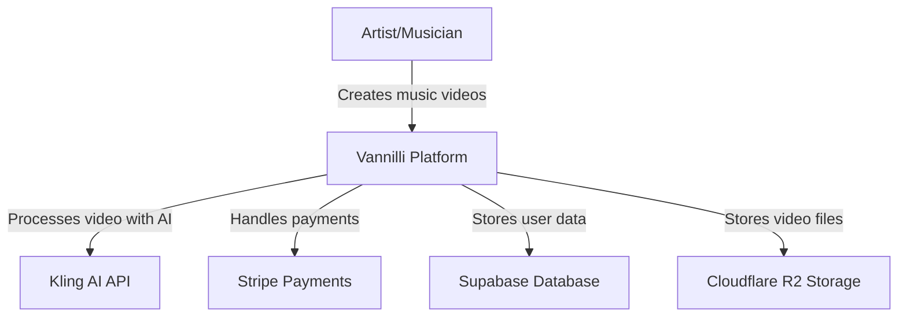
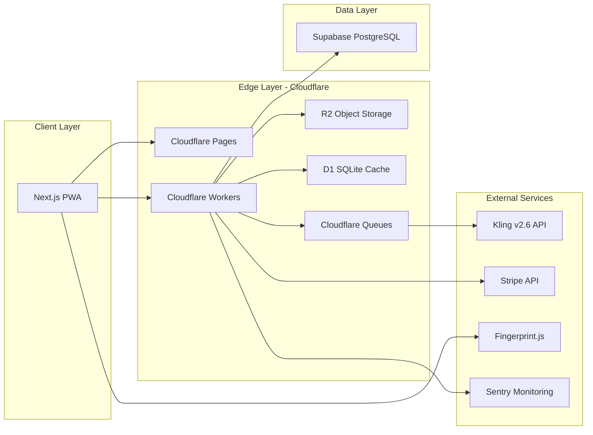
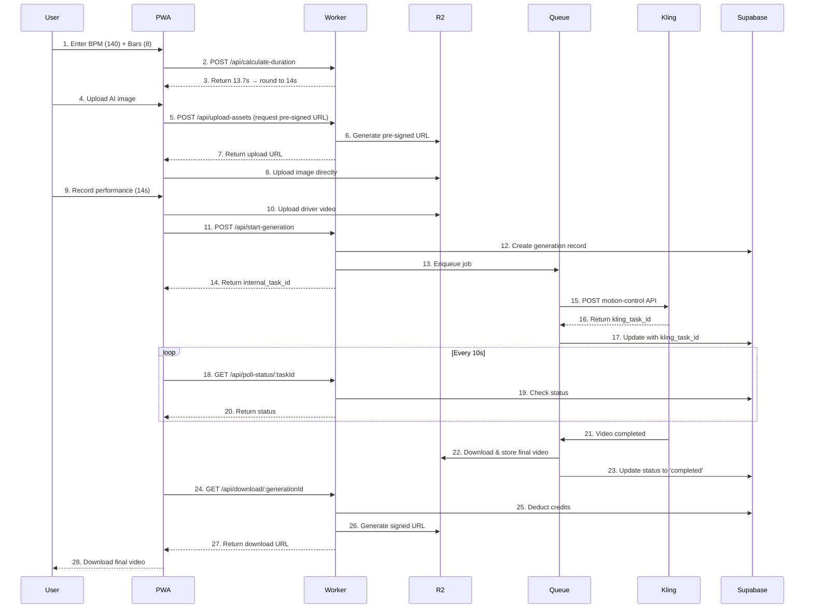

# Vannilli System Architecture

**Version**: 1.0  
**Last Updated**: January 22, 2026  
**Status**: Foundation Phase

## Table of Contents

1. [Executive Summary](#executive-summary)
2. [System Overview](#system-overview)
3. [Core Components](#core-components)
4. [Data Flow](#data-flow)
5. [Infrastructure](#infrastructure)
6. [Security & Compliance](#security--compliance)
7. [Scalability & Performance](#scalability--performance)

## Executive Summary

Vannilli is a serverless, edge-first music video production platform built entirely on Cloudflare infrastructure. The system abstracts complex AI video generation into musician-friendly terms (BPM, bars, measures).

### Key Architectural Decisions

1. **Edge-First**: All API logic runs on Cloudflare Workers for <50ms latency worldwide
2. **Serverless**: Zero infrastructure management, infinite scalability
3. **Model Agnostic**: Adapter pattern allows switching AI providers without code changes
4. **Progressive Web App**: Native-like mobile experience without app store friction

## System Overview

### C4 Context Diagram



### High-Level Architecture



## Core Components

### 1. Frontend (Next.js 14 PWA)

**Location**: `/apps/web`  
**Deployment**: Cloudflare Pages  
**Framework**: Next.js 14 (App Router)

#### Key Features

- Mobile-first responsive design
- Progressive Web App (installable)
- Real-time camera recording with audio sync
- Optimistic UI updates
- Service worker for offline skeleton

#### Routes

- `/` - Landing page with calculator tool
- `/studio/new` - Project creation (BPM, audio, image upload)
- `/studio/record` - Performance recording interface
- `/studio/preview` - Processing status with progress bar
- `/studio/download` - Final video delivery
- `/pricing` - Tier selection and upgrade
- `/showcase` - Public gallery of user videos
- `/calculator` - Free viral marketing tool

### 2. Backend (Cloudflare Workers)

**Location**: `/apps/workers`  
**Runtime**: V8 Isolates (0ms cold start)  
**Language**: TypeScript

#### API Endpoints

##### Authentication & User Management

- `POST /api/auth/signup` - Create account + device fingerprint
- `POST /api/auth/signin` - Login with email/password
- `GET /api/auth/me` - Get current user + credit balance

##### Video Generation Flow

- `POST /api/calculate-duration` - Convert BPM + bars → seconds
- `POST /api/upload-assets` - Upload driver video + target image to R2
- `POST /api/start-generation` - Initiate Kling AI processing
- `GET /api/poll-status/:taskId` - Check job status
- `GET /api/download/:generationId` - Serve final video (deduct credits)

##### Payment & Billing

- `POST /api/checkout` - Create Stripe Checkout session
- `POST /api/webhooks/stripe` - Handle subscription events
- `GET /api/credits/balance` - Get user's credit balance
- `POST /api/credits/topup` - Purchase additional credits

##### Admin & Monitoring

- `GET /api/metrics` - Cost monitoring (Kling spend vs revenue)
- `POST /api/content-report` - Report abuse
- `GET /api/health` - System health check

### 3. Database Schema (Supabase PostgreSQL)

**Location**: `/packages/database`

#### Tables

**users**
```sql
CREATE TABLE users (
  id UUID PRIMARY KEY DEFAULT gen_random_uuid(),
  email TEXT UNIQUE NOT NULL,
  password_hash TEXT NOT NULL,
  stripe_customer_id TEXT UNIQUE,
  tier TEXT NOT NULL DEFAULT 'free' CHECK (tier IN ('free', 'open_mic', 'indie_artist', 'artist', 'label')),
  credits_remaining INTEGER NOT NULL DEFAULT 0,
  free_generation_redeemed BOOLEAN NOT NULL DEFAULT false,
  device_fingerprint TEXT,
  created_at TIMESTAMPTZ NOT NULL DEFAULT NOW(),
  updated_at TIMESTAMPTZ NOT NULL DEFAULT NOW()
);

CREATE INDEX idx_users_email ON users(email);
CREATE INDEX idx_users_stripe_customer ON users(stripe_customer_id);
CREATE INDEX idx_users_device_fingerprint ON users(device_fingerprint);
```

**projects**
```sql
CREATE TABLE projects (
  id UUID PRIMARY KEY DEFAULT gen_random_uuid(),
  user_id UUID NOT NULL REFERENCES users(id) ON DELETE CASCADE,
  track_name TEXT NOT NULL,
  bpm INTEGER NOT NULL CHECK (bpm >= 60 AND bpm <= 200),
  bars INTEGER NOT NULL CHECK (bars >= 1 AND bars <= 32),
  duration_seconds INTEGER NOT NULL,
  audio_r2_path TEXT,
  target_image_r2_path TEXT NOT NULL,
  driver_video_r2_path TEXT NOT NULL,
  status TEXT NOT NULL DEFAULT 'draft' CHECK (status IN ('draft', 'processing', 'completed', 'failed')),
  created_at TIMESTAMPTZ NOT NULL DEFAULT NOW(),
  updated_at TIMESTAMPTZ NOT NULL DEFAULT NOW()
);

CREATE INDEX idx_projects_user_id ON projects(user_id);
CREATE INDEX idx_projects_status ON projects(status);
```

**generations**
```sql
CREATE TABLE generations (
  id UUID PRIMARY KEY DEFAULT gen_random_uuid(),
  project_id UUID NOT NULL REFERENCES projects(id) ON DELETE CASCADE,
  internal_task_id UUID NOT NULL UNIQUE DEFAULT gen_random_uuid(),
  kling_task_id TEXT UNIQUE,
  cost_credits INTEGER NOT NULL,
  status TEXT NOT NULL DEFAULT 'pending' CHECK (status IN ('pending', 'processing', 'completed', 'failed')),
  final_video_r2_path TEXT,
  preview_gif_r2_path TEXT,
  error_message TEXT,
  created_at TIMESTAMPTZ NOT NULL DEFAULT NOW(),
  completed_at TIMESTAMPTZ
);

CREATE INDEX idx_generations_project_id ON generations(project_id);
CREATE INDEX idx_generations_internal_task_id ON generations(internal_task_id);
CREATE INDEX idx_generations_kling_task_id ON generations(kling_task_id);
CREATE INDEX idx_generations_status ON generations(status);
```

**subscriptions**
```sql
CREATE TABLE subscriptions (
  id UUID PRIMARY KEY DEFAULT gen_random_uuid(),
  user_id UUID NOT NULL REFERENCES users(id) ON DELETE CASCADE,
  stripe_subscription_id TEXT UNIQUE NOT NULL,
  tier TEXT NOT NULL CHECK (tier IN ('open_mic', 'indie_artist', 'artist', 'label')),
  status TEXT NOT NULL CHECK (status IN ('active', 'canceled', 'past_due', 'paused')),
  current_period_start TIMESTAMPTZ NOT NULL,
  current_period_end TIMESTAMPTZ NOT NULL,
  cancel_at_period_end BOOLEAN NOT NULL DEFAULT false,
  created_at TIMESTAMPTZ NOT NULL DEFAULT NOW(),
  updated_at TIMESTAMPTZ NOT NULL DEFAULT NOW()
);

CREATE INDEX idx_subscriptions_user_id ON subscriptions(user_id);
CREATE INDEX idx_subscriptions_stripe_id ON subscriptions(stripe_subscription_id);
```

**audit_log**
```sql
CREATE TABLE audit_log (
  id UUID PRIMARY KEY DEFAULT gen_random_uuid(),
  user_id UUID REFERENCES users(id) ON DELETE SET NULL,
  action TEXT NOT NULL,
  resource_type TEXT NOT NULL,
  resource_id UUID,
  metadata JSONB,
  ip_address INET,
  user_agent TEXT,
  created_at TIMESTAMPTZ NOT NULL DEFAULT NOW()
);

CREATE INDEX idx_audit_log_user_id ON audit_log(user_id);
CREATE INDEX idx_audit_log_created_at ON audit_log(created_at DESC);
CREATE INDEX idx_audit_log_action ON audit_log(action);
```

#### Row-Level Security (RLS)

```sql
-- Enable RLS
ALTER TABLE users ENABLE ROW LEVEL SECURITY;
ALTER TABLE projects ENABLE ROW LEVEL SECURITY;
ALTER TABLE generations ENABLE ROW LEVEL SECURITY;
ALTER TABLE subscriptions ENABLE ROW LEVEL SECURITY;

-- Users can only read/update their own data
CREATE POLICY users_select_own ON users FOR SELECT USING (auth.uid() = id);
CREATE POLICY users_update_own ON users FOR UPDATE USING (auth.uid() = id);

-- Users can only access their own projects
CREATE POLICY projects_select_own ON projects FOR SELECT USING (auth.uid() = user_id);
CREATE POLICY projects_insert_own ON projects FOR INSERT WITH CHECK (auth.uid() = user_id);
CREATE POLICY projects_update_own ON projects FOR UPDATE USING (auth.uid() = user_id);

-- Users can only access generations for their projects
CREATE POLICY generations_select_own ON generations FOR SELECT 
  USING (EXISTS (SELECT 1 FROM projects WHERE projects.id = generations.project_id AND projects.user_id = auth.uid()));
```

### 4. Storage (Cloudflare R2)

#### Bucket Structure

**vannilli-raw-uploads** (Lifecycle: Auto-delete after 24h)
- `/driver-videos/{user_id}/{uuid}.mp4` - User performance recordings
- `/target-images/{user_id}/{uuid}.{jpg|png}` - AI art uploads

**vannilli-final-renders** (Lifecycle: Keep 30 days)
- `/videos/{generation_id}/final.mp4` - Completed videos (4K)
- `/videos/{generation_id}/preview.gif` - Low-res watermarked previews
- `/videos/{generation_id}/thumbnail.jpg` - Video thumbnail

#### Access Patterns

- Uploads: Pre-signed URLs (5-minute expiry)
- Downloads: Signed URLs with auth token verification
- Public access: Only for showcase gallery (user opt-in)

### 5. Video Provider Adapter (Model Agnostic)

**Location**: `/packages/kling-adapter`

#### Interface Definition

```typescript
// IVideoGenerator.ts
export interface VideoGenerationRequest {
  driverVideoUrl: string;
  targetImageUrl: string;
  prompt?: string;
  mode?: 'standard' | 'pro';
  characterOrientation: 'image' | 'video';
}

export interface VideoGenerationResponse {
  taskId: string;
  status: 'pending' | 'processing' | 'completed' | 'failed';
  videoUrl?: string;
  thumbnailUrl?: string;
  estimatedCompletionSeconds?: number;
  error?: string;
}

export interface IVideoGenerator {
  startGeneration(request: VideoGenerationRequest): Promise<VideoGenerationResponse>;
  checkStatus(taskId: string): Promise<VideoGenerationResponse>;
  cancelGeneration(taskId: string): Promise<void>;
}
```

#### Implementations

- `KlingV26Adapter` - Current implementation
- `RunwayGen3Adapter` - Future alternative
- `PikaAdapter` - Future alternative

## Data Flow

### End-to-End Video Generation Flow



## Infrastructure

### Cloudflare Configuration

#### Pages (Frontend Hosting)

```yaml
# wrangler.toml for Pages
name = "vannilli-web"
pages_build_output_dir = "apps/web/.next"

[env.production]
compatibility_date = "2026-01-22"
node_compat = true

[env.production.vars]
NEXT_PUBLIC_API_URL = "https://api.vannilli.xaino.io"
NEXT_PUBLIC_STRIPE_PUBLISHABLE_KEY = ""
```

#### Workers (Backend API)

```toml
# wrangler.toml for Workers
name = "vannilli-api"
main = "apps/workers/src/index.ts"
compatibility_date = "2026-01-22"

[env.production]
workers_dev = false
route = "api.vannilli.xaino.io/*"

[[env.production.r2_buckets]]
binding = "RAW_UPLOADS"
bucket_name = "vannilli-raw-uploads"

[[env.production.r2_buckets]]
binding = "FINAL_RENDERS"
bucket_name = "vannilli-final-renders"

[[env.production.d1_databases]]
binding = "CACHE"
database_name = "vannilli-cache"
database_id = ""

[[env.production.queues.producers]]
binding = "VIDEO_QUEUE"
queue = "video-generation-queue"

[env.production.vars]
ENVIRONMENT = "production"
SUPABASE_URL = ""
KLING_API_URL = "https://api.klingai.com/v1"
STRIPE_WEBHOOK_SECRET = ""

[env.production.secrets]
SUPABASE_SERVICE_KEY = ""
KLING_API_KEY = ""
STRIPE_SECRET_KEY = ""
SENTRY_DSN = ""
```

#### R2 Lifecycle Rules

```bash
# raw-uploads bucket - auto-delete after 24h
wrangler r2 bucket lifecycle create vannilli-raw-uploads \
  --expiration-days 1 \
  --prefix "driver-videos/"

wrangler r2 bucket lifecycle create vannilli-raw-uploads \
  --expiration-days 1 \
  --prefix "target-images/"

# final-renders bucket - keep 30 days
wrangler r2 bucket lifecycle create vannilli-final-renders \
  --expiration-days 30 \
  --prefix "videos/"
```

### Supabase Configuration

- **Region**: US East (closest to Cloudflare edge)
- **Plan**: Pro ($25/month for >100K MAU)
- **Postgres Version**: 15
- **Connection Pooling**: Enabled (PgBouncer)
- **Point-in-Time Recovery**: Enabled (7 days)

### External Services

#### Kling AI API

- **Base URL**: `https://api.klingai.com/v1`
- **Model**: v2.6 Motion Control
- **Cost**: $0.07 per second
- **Rate Limits**: 100 requests/minute (negotiable at scale)
- **Authentication**: API key in `Authorization: Bearer` header

#### Stripe

- **Products**:
  - Open Mic: $15 one-time
  - Indie Artist: $15/month (deprecated in favor of Artist tier)
  - Artist: $20/month
  - Label: $50/month
- **Webhooks**: `https://api.vannilli.xaino.io/api/webhooks/stripe`
- **Events**: `customer.subscription.*`, `invoice.payment_*`, `checkout.session.completed`

#### Fingerprint.js

- **Purpose**: Device fingerprinting for fraud prevention
- **Implementation**: Client-side SDK
- **Storage**: `device_fingerprint` column in users table

## Security & Compliance

### Authentication

- **Method**: Supabase Auth (JWT-based)
- **Session Duration**: 7 days
- **Refresh Token**: 30 days
- **MFA**: Optional (TOTP)

### Authorization

- Row-Level Security (RLS) enforced at database level
- JWT claims validated in Cloudflare Workers
- Device fingerprint checked on free-tier requests

### Data Privacy

- **GDPR Compliance**: 30-day data retention, user deletion API
- **CCPA Compliance**: "Do Not Sell" opt-out
- **Face Data**: User grants perpetual license, but data deleted after processing
- **Audit Logging**: All user actions logged for 90 days

### Content Moderation

- **Age Gate**: 13+ required (COPPA compliance)
- **User Attestation**: "I have rights to this audio and image" checkbox
- **Watermarking**: Free-tier videos marked "AI Generated - Not for Commercial Use"
- **Reporting**: `/api/content-report` endpoint for DMCA/abuse

### Rate Limiting

- Free tier: 1 generation per device per 24h
- Paid tiers: 100 generations per hour
- API endpoints: 60 requests/minute per IP

## Scalability & Performance

### Edge Performance

- **Target Latency**: <100ms for API calls (excluding AI processing)
- **CDN**: Cloudflare's global network (275+ cities)
- **Caching**: D1 for read-heavy queries (credit balance), 1-minute TTL

### Database Optimization

- **Indexes**: On all foreign keys and frequently queried columns
- **Connection Pooling**: Max 10 connections per Worker instance
- **Read Replicas**: Not needed initially (Supabase handles internally)

### Video Processing

- **Async Queue**: Cloudflare Queues (decouples API from Kling latency)
- **Retry Logic**: 3 attempts with exponential backoff
- **Status Polling**: Client polls every 10s (optimistic UI updates immediately)

### Cost Projections

**At 10,000 MAU**:
- Kling API: ~$5,000/month (assuming 50% free users, 50% paid)
- Cloudflare: ~$200/month (Workers + R2 + Pages)
- Supabase: $25/month (Pro plan)
- Stripe: ~$150/month (2.9% + $0.30 per transaction)
- **Total**: ~$5,375/month
- **Revenue** (10% paid conversion at $20 avg): ~$20,000/month
- **Margin**: ~73%

### Disaster Recovery

- **Database Backups**: Daily automated (Supabase), 7-day PITR
- **R2 Durability**: 99.999999999% (11 nines)
- **Kling Fallback**: Runway Gen-3 adapter ready (manual switch)
- **Monitoring**: Sentry alerts on >5% error rate

## Development & Deployment

### Local Development

```bash
# Start Next.js dev server
cd apps/web
npm run dev

# Start Cloudflare Workers dev server
cd apps/workers
wrangler dev

# Run Supabase locally
supabase start
```

### CI/CD Pipeline

See `.github/workflows/` for detailed pipeline configuration.

**On PR**: Deploy preview to Cloudflare Pages  
**On merge to main**: Deploy to production + run E2E tests

### Monitoring

- **Cloudflare Analytics**: Request volume, cache hit rate, bandwidth
- **Sentry**: Error tracking with session replay
- **Custom Metrics**: `/api/metrics` dashboard (cost monitoring)
- **Alerts**: Slack webhook on margin < 40%

---

**Next Steps**: See [MUSIC_LOGIC.md](MUSIC_LOGIC.md) for detailed BPM calculation formulas.

